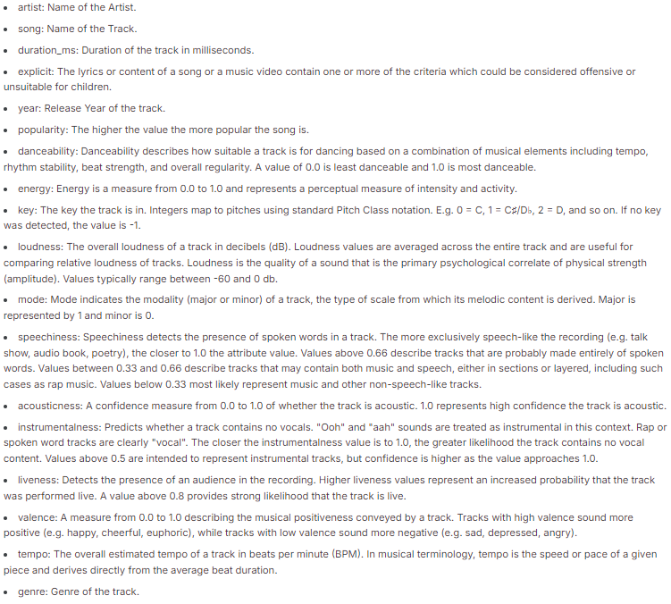

# __Spotify Analysis Project__

## Group 5: Adolphus Momoh Jr, Dylan Phimister, Kimberly Her, Sanjana Prabhakar, and Viktor Bondarenko 

## Description: 

The Spotify Analysis Project investigates the characteristics of the Top Spotify Hits from the year 1999-2019. Specifically, this project focuses on artist and song popularity by emphasizing features like genre, danceability, energy, tempo, loudness, and valence. By understanding how these musical attributes correlate with popularity, we uncover patterns that identify the success of top hits.

## Analysis:

Through our analysis of the Top Hits Spotify dataset, we've found that artists such as Rihanna, Calvin Harris, and Eminem were the most listened to between 1999 and 2019. By examining musical features like danceability and energy, we discovered that songs with higher scores in these areas tend to be more popular. This indicates that listeners are drawn to music that inspires movement and creates an energetic atmosphere, particularly in genres like Pop and Hip-Hop.

We also observed that popularity trends vary over time, suggesting that artists experience ups and downs in their success. These fluctuations may be influenced by factors like a lack of new releases or changes in their musical style. Moreover, characteristics such as loudness and valence indicate that songs with a more positive sound tend to be more popular than those with lower valence or less positivity.

In conclusion, this analysis not only enhances our understanding of the attributes of artists and their songs but also sheds light on the factors that contribute to popularity in the music industry. It paves the way for further exploration into the changing preferences of music consumers and how emerging trends might shape future musical creations.

## Ethics:

The Spotify dataset "Top Hits Spotify from 2000-2019" was acquired from Kaggle and is available for free download and use. The music data utilized in our analysis is public information that is widely accessible.

### Note: 
Despite the dataset being titled 'Top Hits Spotify from 2000-2019,' we identified an outlier - a song released in 1999. We opted to include this song in our analysis to ensure that no unique data was inadvertently excluded.

## Folders:
- Codes: Includes the "Data_cleanup_code" and the main "SpotifyProject" Jupyter Notebook code. 
- Dataset: Holds the CSV datasets used in this project:
    - "(original_csv)songs_normalize.csv" - original CSV file downloaded from Kaggle 
    - "(first_cleaned_ver)cleaned_songs_data" - first cleaned version of the dataset
    - "project_3_clean" - final dataset used in code
- Visuals_HTML: Contains the HTML file to launch live server and the HTML versions of the graphs/visualizations.
- Visuals_PNG(use_for_README): PNG versions of the visuals used in the README file. 

## Content Information

## Visuals: 

### Top 10% Most Popular Songs: Loudness vs Valence: 
/Top_10_Percent.png>)

This scatter plot shows the relationship between loudness (in decibels) and valence (a measure of musical positivity) for the top 10% of most popular songs. Each point represents a song, and the size and shade of the points correspond to the song's popularity. Darker and larger points indicate higher popularity.

### Bottom 10% Most Popular Songs - Loudness vs. Valence: 
/Bottom_10_Percent.png>)

This scatter plot shows the relationship between loudness and valence for the bottom 10% least popular songs. The plot follows a similar format to the previous chart but focuses on the least popular tracks.

### Top 10 Artists by Number of Songs: 
/Top_10_Artists_by_Number_of_Songs.png>)

This bar chart visualizes the top 10 artists with the most songs in the dataset. Each bar represents an artist, with the height of the bar corresponding to the total number of songs they have contributed to the dataset. This chart helps you quickly identify which artists are most prolific in terms of the number of songs they have in the dataset. It is useful for understanding the concentration of music production among top artists.

### Top 10 Artists by Number of Songs and Average Popularity: 
/Top_10_Artists_by_Number_of_Songs_and_Popularity.png>)

This chart compares the top 10 artists in terms of both the number of songs they have and their average popularity score. The chart helps to see not only which artists have the most songs but also whether they are popular on average. This gives a balanced view of both the quantity and the quality (in terms of popularity) of the songs contributed by the top 10 artists. You can identify whether prolific artists also tend to have higher popularity or not.

### Average Danceability and Energy of Top 10 Artists: 
/Danceability_and_Energy.png>)

This visualizes the average danceability and energy ratings for the songs of the top 10 artists. This chart helps to see how a song's danceability rating correlates to the energy of the song.

### Song Genres Distrbution: 
/Song_Genres_Distribution.png>)

This chart displays the distribution of different genres within the dataset. Larger slices indicate genres that dominate the dataset, while smaller slices represent more niche genres.

### Genre Distribution of Pop and Hip Hop: 
/Genre_Distribution_of_Selected_Artists.png>)

This chart focuses on the genres of songs that belong to the top 10 artists. Seeing that there are only two genres, we can determine which genres are the most popular amongst listeners.

### Song Popularity Trends by Year for Top 10 Artists: 
/Song_Popularity_Trends.png>)

This line chart tracks the popularity of songs over time for the top 10 artists. Each line represents an artist, and the y-axis reflects the average song popularity, while the x-axis shows the release years of the songs. This visualization reveals the trajectory of each artist's popularity over the years. By examining the trends, you can see if an artist's music has gained or lost popularity over time. It highlights the evolution of music preferences and artist success throughout different periods.

### Average Tempo Distribution by Genre: 
/Average_Tempo_Distribution_by_Genre.png>)

This pie chart shows the proportion of different genres based on their average tempos. Each slice represents a genre, and the size of the slice corresponds to the average tempo of that genre compared to others. This visualization highlights which genres have higher average tempos. You can quickly identify if a genre is more characterized by fast-paced music (e.g., electronic genres) or slower rhythms (e.g., ballads).

## Dependencies and Libraries:
- Numpy as np
- Pandas as pd
- Matplotlib.pyplot as plt
- os
- Seaborn as sns
- Pymongo -> MongoClient
- Bokeh.io -> show
- Bokeh.plotting -> figure
- Bokeh.transform -> cumsum
- Bokeh.palettes -> Category20c
- Math -> pi
- Plotly.express as px

## Installation
1. Clone the repository.
2. Create a virtual environment.
3. Install the required packages.
4. Run the Jupyter Notebook.

## Usage 
Data Analysis: The notebook contains multiple sections, each focusing on a different aspect of song popularity analysis. Run the cells sequentially to see the visualizations and outputs.

Visualizations: You can explore each chart interactively, zoom in on the scatter plots, and analyze key trends.

## Acknowledgements 
This project was made possible through the collaborative efforts of an exceptional team. Special thanks to all the teammates who contributed their time and expertise to different aspects of the project, from data cleaning and storage to interactive visualizations and overall analysis. We would also like to extend our appreciation to the University of Minnesota's Data Analytics Bootcamp for providing guidance and support throughout this process. Additionally, the use of several key open-source libraries, including Pandas, Plotly, and MongoDB, played a crucial role in the successful completion of this project. Thank you all for your invaluable contributions.

## References
The Spotify "Top Hits Spotify from 2000-2019" dataset is from Kaggle, reference the link here: https://www.kaggle.com/datasets/paradisejoy/top-hits-spotify-from-20002019.

Codes were referenced from class activities and we used ChatGPT when our codes weren't running properly. 

## Project Status
This project is complete. All deliverables, including data analysis, visualizations, and documentation, have been successfully implemented. Future improvements and optimizations may be explored, but for now, the core objectives have been fully achieved.

## Thank you for visiting our Spotify Analysis Project!
